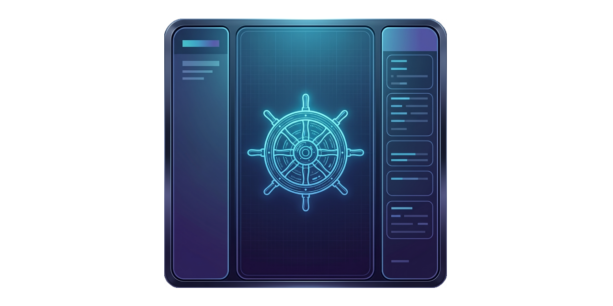

# :zap: LFK - Lightning Fast Kubernetes navigator

[](https://github.com/janosmiko/lfk/releases) [](https://github.com/janosmiko/lfk/actions/workflows/ci.yml) [](https://goreportcard.com/report/github.com/janosmiko/lfk) [](https://sonarcloud.io/dashboard?id=janosmiko_lfk) [](https://sonarcloud.io/dashboard?id=janosmiko_lfk) [](https://codecov.io/gh/janosmiko/lfk) [](https://scorecard.dev/viewer/?uri=github.com/janosmiko/lfk) 

**LFK** is a lightning-fast, keyboard-focused, yazi-inspired terminal user interface for navigating and managing Kubernetes clusters. Built for speed and efficiency, it brings a three-column Miller columns layout with an owner-based resource hierarchy to your terminal.

## Screenshots

### Demo


### Themes


### Pods


### Pods fullscreen


### Helm integration


### ArgoCD integration


### ConfigMap and Secret editors


### Label and annotation editor


### Can-I RBAC permissions browser


### YAML preview


### API Explorer


## Features

### Navigation and Layout

- **Three-column Miller columns** interface (parent / current / preview)
- **Owner-based navigation**: Clusters -> Resource Types -> Resources -> Owned Resources -> Containers
- **Resource groups**: Dashboards, Workloads, Networking, Config, Storage, ArgoCD, Helm, Access Control, Cluster, Custom Resources
- **Pinned CRD groups**: Pin frequently used CRD API groups so they appear after built-in categories. Configurable via `pinned_groups` in config or interactively with `p` key (stored per-context)
- **CRD categories**: Discovered CRDs are grouped by API group name (e.g., `argoproj.io`, `longhorn.io`, `networking.istio.io`)
- **Hide rarely used resources**: CSI internals, admission webhooks, APF, leases, runtime classes, and uncategorized core resources are hidden by default. Press `H` to surface them under their categories and an "Advanced" group (resets each launch)
- **Expandable/collapsible resource groups** with `z`
- **Fullscreen middle column** toggle with `Shift+F`
- **Vim-style keybindings** throughout (fully customizable via config)
- **Mouse support**: Click to navigate, scroll wheel to move, Shift+Drag for native terminal text selection

### Cluster Management

- **Multi-tab support**: Open multiple views side by side
- **Multi-cluster/multi-context support** via merged kubeconfig loading
- **Merged kubeconfig loading**: `~/.kube/config`, `~/.kube/config.d/*` (recursive, symlinks followed), and `KUBECONFIG` env var
- **Cluster dashboard** when entering a context (configurable)
- **Monitoring dashboard** with active Prometheus/Alertmanager alerts (`@` key), configurable endpoints per cluster
- **API Explorer** for interactively browsing resource structure (`I` key) with recursive field browser
- **Namespace selector** overlay with type-to-filter
- **All-namespaces mode** (enabled by default)

### Resource Operations

- **Context-aware action menus**: logs, exec, attach, debug, scale, restart, delete, describe, edit, events, port-forward, vuln scan, PVC resize
- **Custom user-defined actions**: Define custom shell commands per resource type in config
- **Multi-select with bulk actions**: Select multiple resources with Space, range-select with Ctrl+Space, perform bulk delete, scale, restart, and ArgoCD bulk sync/refresh
- **Resource sorting** by name, age, or status
- **Filter and search**: Filter with `f`, search with `/` -- supports substring, regex (auto-detected), and fuzzy (`~` prefix) modes
- **Abbreviated search**: Type `pvc`, `hpa`, `deploy` etc. to jump to resource types
- **Command bar** (`:`) with vertical dropdown autocomplete: resource jumps (`:pod`, `:dep`), built-in commands (`:ns`, `:ctx`, `:set`, `:sort`, `:export`), kubectl with `:k`/`:kubectl` prefix and flag/namespace completion, shell commands (`:!`). Value positions (namespace, context, resource name, option, column, format) accept fuzzy matches; command names stay on prefix.
- **Watch mode**: Auto-refresh resources every 2 seconds (enabled by default)
- **Owner/controller navigation**: Jump to the owner of any resource with `o`
- **Events view** with warnings-only filter toggle and duplicate-event grouping (`z`)

### Preview and Editing

- **YAML preview** in the right column with syntax highlighting
- **Full-screen YAML viewer** with scrollable output, search, section folding (`Tab`/`z`), and in-place editing
- **Resource details** summary in split preview (toggle with `Shift+P`)
- **Inline log viewer** with streaming, search, line numbers, word wrap, follow mode, timestamps toggle, previous container logs, container filter, tail-first loading, line jump, structured preview pane (`P`: parses the selected line as JSON or logfmt, falls back to plain text), and automatic reconnect across init-container transitions (stays attached as each init container finishes and the next one starts)
- **Inline describe view** with scrollable output
- **Secret viewing/editing** with decode toggle (`Ctrl+S`) and dedicated editor (`e`)
- **Embedded terminal** (PTY mode) for exec and shell with tab switching — PTY keeps running in background when switching tabs

### Resource Management

- **Resource templates**: Create resources from 25+ built-in templates (`a`, `/` to search); includes a Custom Resource template as a starting point
- **Port forwarding** from the action menu (with local port setting and browser open); manage active forwards via the Networking group
- **Clipboard support**: Copy resource name (`y`), YAML (`Y`), paste/apply from clipboard (`Ctrl+P`), paste into search/filter boxes (`Cmd+V` / `Ctrl+Shift+V`)
- **Bookmarks**: Save favorite resource paths for quick navigation
- **Session persistence**: Remembers last context/namespace/resource across restarts
- **Command bar**: Press `:` for shell/kubectl commands with autocompletion

### Integrations

- **ArgoCD integration**: Browse Applications, sync, terminate sync, refresh, view managed resources
- **Argo Workflows integration**: Suspend/resume, stop/terminate, resubmit Workflows; submit from WorkflowTemplates; suspend/resume CronWorkflows
- **Helm integration**: Browse releases, view managed resources, uninstall
- **KEDA integration**: Pause/unpause ScaledObjects and ScaledJobs
- **External Secrets integration**: Force refresh ExternalSecrets, ClusterExternalSecrets, and PushSecrets
- **CRD discovery**: Automatically discovers installed CRDs and groups them by API group

### Customization

- **460+ built-in color schemes** from [ghostty themes](https://github.com/ghostty-org/ghostty): Tokyonight, Catppuccin, Dracula, Nord, Rose Pine, Gruvbox, and many more. Transparent background support.
- **Runtime theme switching**: Press `T` to preview and switch themes without restarting
- **Auto dark/light mode**: configure a dark and a light scheme; lfk switches automatically when the OS appearance changes (requires CSI 996/2031 terminal support: Ghostty, kitty, Contour, …)
- **Custom color themes** via config file (Tokyonight theme by default)
- **Configurable keybindings** for direct actions
- **Configurable search abbreviations**
- **Configurable filter presets** per resource type (extend built-in quick filters with `.`)
- **Configurable icon modes**: `auto` (default, detects Nerd Font-capable terminals like Ghostty/Kitty/WezTerm), `unicode`, `nerdfont` (Material Design Icons), `simple` (ASCII labels), `emoji`, or `none`. Override at runtime with the `LFK_ICONS` environment variable.
- **Configurable table columns** (global, per-resource-type, and per-cluster)
- **Column visibility toggle** overlay to show/hide and reorder columns at runtime (`,` key)
- **Startup tips**: Random tips on startup to help discover features (configurable via `tips: false`)
- **Status-aware coloring**: Running=green, Pending=yellow, Failed=red
- **Resource usage metrics**: CPU/MEM with color-coded bars in dashboard

## Installation

```bash
# Homebrew (macOS / Linux)
brew install janosmiko/tap/lfk

# Go
go install github.com/janosmiko/lfk@latest

# Nix
nix run github:janosmiko/lfk
```

`kubectl` is required and must be configured. `helm` and `trivy` are optional (Helm management, image vulnerability scanning).

> See [docs/installation.md](docs/installation.md) for Docker, nightly builds, NixOS/home-manager flake input, building from source, and the full list of optional CLI dependencies.

## Usage

```bash
# Use default kubeconfig (~/.kube/config + ~/.kube/config.d/*)
lfk

# Start in a specific context / namespace
lfk --context my-cluster -n kube-system

# Use a specific kubeconfig
lfk --kubeconfig /path/to/kubeconfig
KUBECONFIG=/path/to/config1:/path/to/config2 lfk
```

> See [docs/usage.md](docs/usage.md) for the full CLI reference and runtime tuning options: mouse capture, no-color mode, watch-mode interval, discovery cache (`KUBECACHEDIR`), and Secret lazy loading.

## Navigation Hierarchy

```
Clusters (kubeconfig contexts)
  +-- Resource Types (grouped: Workloads, Networking, Config, Storage, ArgoCD, Helm, ...)
        +-- Resources (e.g., individual Deployments)
              +-- Owned Resources (Pods via ownerReferences, Jobs for CronJobs, etc.)
                    +-- Containers (for Pods)
```

Namespaces are **not** a navigation level. The current namespace is shown in the top-right corner and can be changed by pressing `\`. All-namespaces mode is enabled by default (toggle with `A`).

### Owner Resolution

- **Deployments** show their Pods (resolved through ReplicaSets, flattened)
- **StatefulSets / DaemonSets / Jobs** show their Pods directly
- **CronJobs** show their Jobs
- **Services** show Pods matching the service selector
- **ArgoCD Applications** show managed resources (from status or label discovery)
- **Helm Releases** show managed resources (via `app.kubernetes.io/instance` label)
- **Pods** show their Containers
- **ConfigMaps / Secrets / Ingresses / PVCs** show details preview (no children)

## Keybindings

> For the complete keybinding reference (YAML view, log viewer, describe, diff, exec mode, and all sub-modes), see [docs/keybindings.md](docs/keybindings.md). Press `?` or `F1` in-app for the built-in help screen.

### Navigation

| Key | Action |
|---|---|
| `h` / `Left` | Navigate to parent level |
| `l` / `Right` | Navigate into selected item |
| `j` / `Down` | Move cursor down |
| `k` / `Up` | Move cursor up |
| `gg` / `Home` | Jump to top of list |
| `G` / `End` | Jump to bottom of list |
| `Ctrl+D` / `Ctrl+U` | Half-page scroll down/up |
| `Ctrl+F` / `Ctrl+B` / `PgDn` / `PgUp` | Full-page scroll down/up |
| `Enter` | Open full-screen YAML view / navigate into |
| `z` | Toggle expand/collapse all resource groups / toggle event grouping (Events view) |
| `p` | Pin/unpin CRD group (at resource types level) |
| `H` | Toggle rarely used resource types (CSI internals, webhooks, leases, advanced core) in the sidebar |
| `0` / `1` / `2` | Jump to clusters / types / resources level |
| `J` / `K` | Scroll preview pane down/up |
| `o` | Jump to owner/controller of selected resource |

### Views and Modes

| Key | Action |
|---|---|
| `?` | Toggle help screen |
| `f` | Filter items in current view |
| `/` | Search and jump to match |
| `n` / `N` | Next / previous search match |
| `P` | Toggle between details and YAML preview |
| `M` | Toggle resource relationship map |
| `F` | Toggle fullscreen (middle column or dashboard) |
| `.` | Quick filter presets |
| `!` | Error log (V/v select, y copy, f fullscreen) |
| `Ctrl+S` | Toggle secret value visibility |
| `Ctrl+G` | Finalizer search and remove |
| `I` | API Explorer (browse resource structure interactively) |
| `U` | RBAC permissions browser (can-i) |
| `T` | Open theme selector |
| `:` | Command bar: resource jumps (`:pod`, `:dep`), built-ins (`:ns`, `:ctx`, `:set`, `:sort`, `:export`), kubectl (`:k get pod`), shell (`:! cmd`) |
| `w` | Toggle watch mode (auto-refresh) |
| `,` | Column visibility toggle (show/hide and reorder columns) |
| `>` / `<` | Sort by next / previous column |
| `=` | Toggle sort direction (ascending/descending) |
| `-` | Reset sort to default (Name ascending) |
| `W` | Save resource to file / toggle warnings-only (Events) |
| `Ctrl+T` | Toggle terminal mode (pty embedded / exec takeover) |
| `@` | Monitoring overview (active Prometheus alerts) |
| `Q` | Namespace resource quota dashboard |

### Actions

| Key | Action |
|---|---|
| `x` | Action menu (logs, exec, describe, edit, delete, scale, port-forward, etc.) |
| `\` / `A` | Namespace selector / toggle all-namespaces |
| `L` | View logs |
| `v` | Describe resource |
| `D` / `X` | Delete / force delete |
| `y` / `Y` | Copy name / YAML to clipboard |
| `Space` | Toggle multi-selection (bulk actions via `x`) |
| `m<slot>` / `'<slot>` | Set / jump to bookmark (lowercase = context-aware, uppercase = context-free) |
| `t` / `]` / `[` | New tab / next / previous |

All views (YAML, logs, describe, diff, exec) use vim-style navigation (`j`/`k`, `gg`/`G`, `Ctrl+D`/`Ctrl+U`, `/` search, `v`/`V` visual selection). See [docs/keybindings.md](docs/keybindings.md) for the full reference.

> For the complete command bar reference (built-in commands, shell/kubectl execution, resource jumps), see [docs/commands.md](docs/commands.md).

## Configuration

Create `~/.config/lfk/config.yaml` to customize the application. All fields are optional; only the values you specify will override the defaults.

> For the complete configuration reference, see [docs/config-reference.md](docs/config-reference.md) and [docs/config-example.yaml](docs/config-example.yaml).

### Quick Start

```yaml
# Color scheme (press T in-app to browse 460+ themes with live preview)
# Auto dark/light mode — Ghostty-style "dark:X,light:Y" syntax switches the
# scheme when the OS appearance changes (CSI 996/2031; Ghostty, kitty >= 0.27, …)
colorscheme: "dark:catppuccin-mocha,light:catppuccin-latte"

# Use terminal's own background
transparent_background: true

# Icon mode: "auto" (default, detects Nerd Font terminals like Ghostty/Kitty/WezTerm),
# "unicode", "nerdfont" (requires Nerd Font in terminal), "simple" (ASCII labels),
# "emoji", or "none". The LFK_ICONS env var overrides this setting.
icons: auto

# Disable mouse capture (allows native terminal text selection)
mouse: false

# Custom keybinding overrides (only specify what you want to change)
keybindings:
  logs: "L"
  describe: "v"
  delete: "D"

# Search abbreviations (extend built-in abbreviations for :pod, :dep, etc.)
abbreviations:
  myapp: myapplications
```

### Search Modes

All search and filter inputs support three modes, auto-detected from the query string:

| Mode | Syntax | Example |
|---|---|---|
| Substring | plain text | `nginx` |
| Regex | auto-detected | `err[0-9]+` |
| Fuzzy | `~` prefix | `~deplymnt` |
| Literal | `\` prefix | `\err.*` |

**Clipboard paste**: All search, filter, and command bar inputs accept pasted text (`Cmd+V` on macOS, `Ctrl+Shift+V` on Linux). Multiline paste shows a confirmation dialog.

**Recall previous queries**: While the `f` filter or `/` search input is open, press `Up` / `Down` to cycle through previous queries. `/` and `f` share one history (the matcher and matched fields are identical between them), kept separate from the `:` command bar. Both persist across sessions under `$XDG_STATE_HOME/lfk/` (default `~/.local/state/lfk/`) — `query-history` for `/` and `f`, `history` for the command bar.

## Contributing

Contributions are welcome — see [CONTRIBUTING.md](CONTRIBUTING.md) for prerequisites, development setup, build/test commands, project layout, and the PR submission flow.

## Support

If you find lfk useful and want to support its development:

- [GitHub Sponsors](https://github.com/sponsors/janosmiko)
- [Buy Me a Coffee](https://buymeacoffee.com/janosmiko)

## License

Apache License 2.0 - see [LICENSE](LICENSE) for details.

## Star History

<a href="https://www.star-history.com/?repos=janosmiko%2Flfk&type=date&legend=top-left">
 <picture>
   <source media="(prefers-color-scheme: dark)" srcset="https://api.star-history.com/chart?repos=janosmiko/lfk&type=date&theme=dark&legend=top-left" />
   <source media="(prefers-color-scheme: light)" srcset="https://api.star-history.com/chart?repos=janosmiko/lfk&type=date&legend=top-left" />
   
 </picture>
</a>
